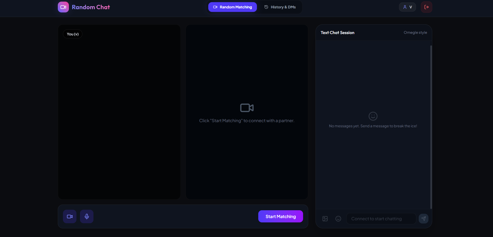

<div align="center">

# Random Video Chat

A modern **Omegle-inspired** real-time video chat platform built with **React, Node.js, Socket.IO, and WebRTC**.

Connect instantly with random people through **video**, **text chat**, and **real-time messaging**.

<br/>

[🌐 Live Demo](https://video-chat-umber-alpha.vercel.app/) •
[💻 Source Code](https://github.com/VCM-5105/Video-Chat)

</div>

---

## ✨ Features

-  Real-time Video Calling
-  Instant Text Messaging
-  Random User Matching
-  Skip & Find New Partner
-  Chat History(Additional feature)
-  Secure Authentication(Additional feature)
-  User Profiles(Additional feature)
-  Modern Responsive UI(Additional feature)
-  Low Latency Communication
-  Mobile Friendly(Additional feature)

---

## ScreenShots

### Authentication

<p align="center">

</p>

### Random Matching

<p align="center">

</p>

> Replace the image paths with your screenshots after creating an `assets/` folder.

---

## 🛠 Tech Stack

### Frontend

- React
- Vite
- JavaScript
- CSS
- Socket.IO Client

### Backend

- Node.js
- Express.js
- Socket.IO
- WebRTC

### Deployment

- Vercel (Frontend)
- Render (Backend)

---

## 🚀 Getting Started

### Clone Repository

```bash
git clone https://github.com/VCM-5105/Video-Chat.git
cd Video-Chat
```

### Frontend

```bash
cd frontend
npm install
npm run dev
```

### Backend

```bash
cd backend
npm install
npm start
```

---

## 📂 Project Structure

```
Video-Chat
│
├── frontend
│   ├── src
│   ├── public
│   └── ...
│
├── backend
│   ├── routes
│   ├── socket
│   ├── server.js
│   └── ...
│
└── README.md
```

---

## 💡 Future Improvements

- Screen Sharing
- Friend Requests
- Group Video Calls
- Notifications

---

## 🤝 Contributing

Contributions are always welcome.

1. Fork the repository
2. Create a new branch

```bash
git checkout -b feature-name
```

3. Commit your changes

```bash
git commit -m "Added feature"
```

4. Push

```bash
git push origin feature-name
```

5. Open a Pull Request

---

## 👨‍💻 Author

**Vipul Chandra Mishra**

GitHub:
https://github.com/VCM-5105
<br>
linked in:www.linkedin.com/in/vipul5105

---

<div align="center">

⭐ If you found this project useful, consider giving it a star!


</div>